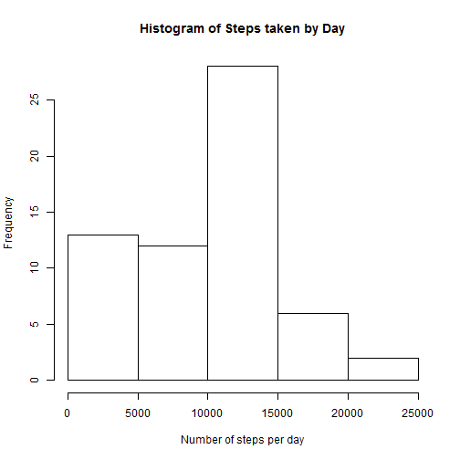
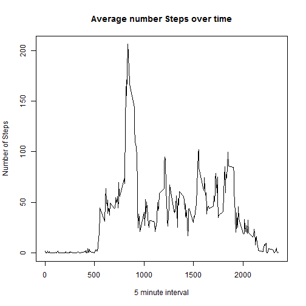
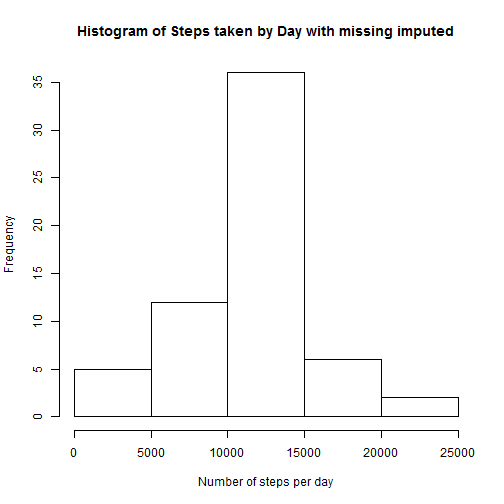
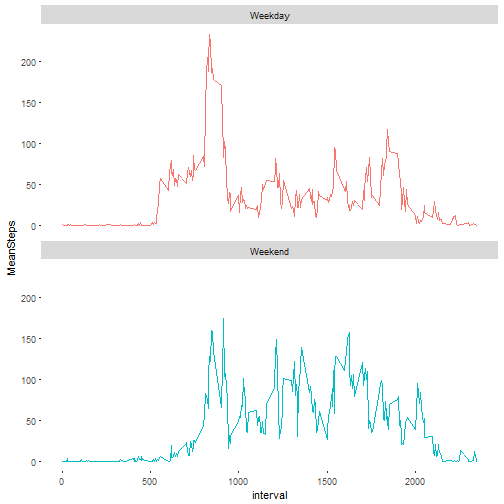

# Coursera Reproducible Reaearch Week 2 Assignment
#### 29 January 2017

1. Load libraries and read data 


```r
library(ggplot2)
data1 <-read.csv("activity.csv",header=TRUE)
```

##What is mean total number of steps taken per day? 
1. Make a histogram of the total number of steps taken each day


```r
q1 <- with(data1, tapply(steps,date,sum,na.rm=TRUE))
hist(q1,main="Histogram of Steps taken by Day",xlab='Number of steps per day')
```



2. Calculate and report the mean and median total number of steps taken per day


```r
meansteps   <- round(mean(q1), digits = 0)
mediansteps <- median(q1)
```

The Mean number of Steps are: 9354  
The Median number of Steps are: 10395  

##What is the average daily activity pattern?

1.  Make a time series plot (i.e. type = "l") of the 5-minute interval (x-axis) and the average number of steps taken, averaged across all days (y-axis)


```r
##Calculate Average Steps by 5 minute time period

q2       <- aggregate(x=data1$steps,
                      by=list(data1$interval),
                      FUN=mean,
                      na.rm=TRUE)
colnames(q2)[1] <- "Interval"
colnames(q2)[2] <- "MeanSteps"

##Plot

with(q2,  plot(Interval,MeanSteps
               ,type = "l"
               ,xlab="5 minute interval"
               ,ylab="Number of Steps"
               ,main="Average number Steps over time"
               )
)
```




2.  Which 5-minute interval, on average across all the days in the dataset, contains the maximum number of steps?


```r
maxstep_rownum <- which.max(q2$MeanSteps)
maxstep_time <- q2[maxstep_rownum,1]
```

The 5 minute time interval with the most steps is: 835

##Imputing missing values

1. Calculate and report the total number of missing values in the dataset (i.e. the total number of rows with NAs)


```r
num <- sum(is.na(data1$steps))
```

The number of rows with Missing Steps is: 2304

2. Devise a strategy for filling in all of the missing values in the dataset. The strategy does not need to be sophisticated. For example, you could use the mean/median for that day, or the mean for that 5-minute interval, etc
  
Strategy devised is to calculate the mean for each 5 minute perid and use this in place of missing data


```r
##calculate average for 5 minute period with Missing removed
q3       <- aggregate(x=data1$steps,
                      by=list(data1$interval),
                      FUN=mean,
                      na.rm=TRUE)

colnames(q3)[1] <- "interval"
colnames(q3)[2] <- "MeanSteps"
```

3. Create a new dataset that is equal to the original dataset but with the missing data filled in.


```r
q3_merge = merge(data1,q3,by="interval")
q3_merge$newsteps = ifelse(is.na(q3_merge$steps), q3_merge$MeanSteps, q3_merge$steps)
```

4a. Make a histogram of the total number of steps taken each day 


```r
q3_totalsteps <- with(q3_merge, tapply(newsteps,date,sum,na.rm=TRUE))
hist(q3_totalsteps,main="Histogram of Steps taken by Day with missing imputed"
                  ,xlab='Number of steps per day')
```



4b. Calculate and report the mean and median total number of steps taken per day. Do these values differ from the estimates from the first part of the assignment? What is the impact of imputing missing data on the estimates of the total daily number of steps?


```r
newmean <-  round(mean(q3_totalsteps), digits = 0)
newmedian <- round(median(q3_totalsteps), digits = 0)
```


The new mean including imputed data is: 1.0766 &times; 10<sup>4</sup>   
The new median including imputed data is: 1.0766 &times; 10<sup>4</sup>   

The mean and median have increased 

##Are there differences in activity patterns between weekdays and weekends?

Create a new factor variable in the dataset with two levels - "weekday" and "weekend" indicating whether a given date is a weekday or weekend day.


```r
q4 <- q3_merge
q4$day <- weekdays(as.Date(as.character(q4$date),format="%Y-%m-%d"))    
q4$weekday_flag = ifelse(q4$day %in% c("Sunday","Saturday"), "Weekend", "Weekday")


q4_summarise     <- aggregate(x=q4$steps,
                      by=list(q4$interval,q4$weekday_flag),
                      FUN=mean,
                      na.rm=TRUE)
colnames(q4_summarise)[1] <- "interval"
colnames(q4_summarise)[2] <- "Weekday_flag"
colnames(q4_summarise)[3] <- "MeanSteps"
```

Make a panel plot containing a time series plot (i.e. type = "l") of the 5-minute interval (x-axis) and the average number of steps taken, averaged across all weekday days or weekend days (y-axis). See the README file in the GitHub repository to see an example of what this plot should look like using simulated data.


```r
q4_plot <- ggplot(q4_summarise, 
                  aes(x=interval, y=MeanSteps, color = Weekday_flag)) +
                  geom_line() +
                  facet_wrap(~Weekday_flag,ncol=1) +
                  theme(legend.position="none",
                        panel.background = element_rect(fill = "white")
                        )
print(q4_plot)
```


